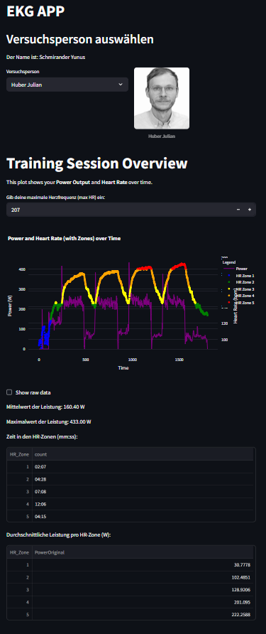
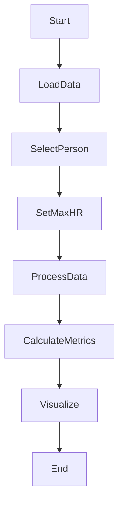
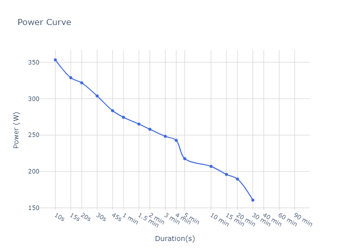
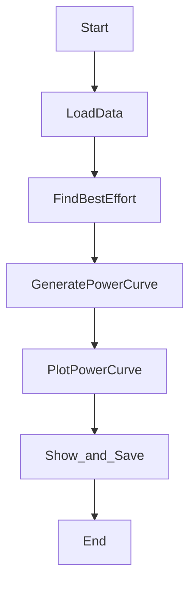

# ❤️‍🔥 EKG App – Analyse & Visualisierung von Trainingsdaten

## 🧾 Übersicht

Die **EKG App** dient der intuitiven Visualisierung und Analyse von Trainingsdaten (Leistung & Herzfrequenz) einer Versuchsperson. Sie ermöglicht:

- die Auswahl einer Testperson,
- das Festlegen der maximalen Herzfrequenz,
- sowie die grafische Darstellung von Leistungsdaten und Herzfrequenzzonen (HR-Zonen).

Dabei werden automatisch folgende Kennwerte berechnet:

- 🏋️‍♂️ Durchschnittliche und maximale Leistung  
- ⏱️ Verweildauer in den einzelnen HR-Zonen  
- 📊 Durchschnittliche Leistung je Herzfrequenzzone  

---

## 🚀 App starten

### 🔧 Voraussetzungen

- 🐍 Python ≥ 3.8  
- 📦 Paketmanager [PDM](https://pdm.fming.dev/)  
- 📄 Abhängigkeiten laut `pyproject.toml`

### ▶️ Schritt-für-Schritt-Anleitung

1. Repository klonen:
   ```bash
   git clone https://github.com/KRSI58/programmieruebung_2-5.git
   ```

2. Projekt initialisieren:
   ```bash
   pdm init
   ```

3. App starten:
   ```bash
   streamlit run main.py
   ```
---
## 🖼️APP Screenshot


---

## 🗂️Projektstruktur

|📁Datei/Ordner          | 📝Beschreibung                                                   |
| --------------------- | -------------------------------------------------------------- |
| `data/`               | Übergeordneter Ordner für alle Daten                           |
| `data/activities/`    | Aktivitätsdaten der Testpersonen                               |
| `data/ekg_data/`      | EKG-Rohdaten der Trainingssessions                             |
| `data/pictures/`      | Profilbilder der Versuchspersonen                              |
| `data/person_db.json` | JSON-Datei mit Stammdaten und EKG-Testverweisen der Personen   |
| `main.py`             | Einstiegspunkt der App                                         |
| `read_data.py`        | Funktionen zum Einlesen der Daten                              |
| `read_pandas.py`      | Funktionen zur Darstellung mit Pandas + Erstellen und Darstellen Powercurve                      |
| `pyproject.toml`      | Definition der Abhängigkeiten und Projektkonfiguration für PDM |
| `pdm.lock`            | Lock-Datei mit exakt aufgelösten Abhängigkeiten                |
| `.gitignore`          | Dateien und Ordner, die von Git ignoriert werden               |
| `README.md`           | Projektbeschreibung und Anleitung zur Nutzung                  |

---

## 🔄Ablaufdiagramm



---

# ⚡ Aufgabe 4 – Power Curve Analyse

Diese Aufgabe generiert eine **Power Curve** aus Leistungsdaten (in Watt), z. B. aus Radfahr-Aktivitäten.  
Die Power Curve zeigt die **maximal erreichbare Durchschnittsleistung** über verschiedene Zeitintervalle  
(z. B. 5 s, 1 min, 5 min, …) und gibt damit einen schnellen Überblick über die Belastbarkeit der Testperson  
in verschiedenen Phasen der Belastung.

---

## 🖼️ Screenshot



---

## 🔄Ablaufdiagramm Aufgabe 4


